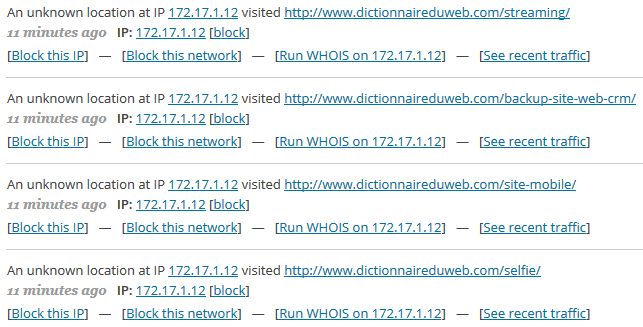
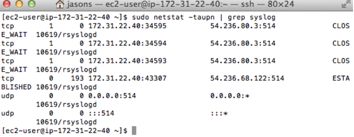
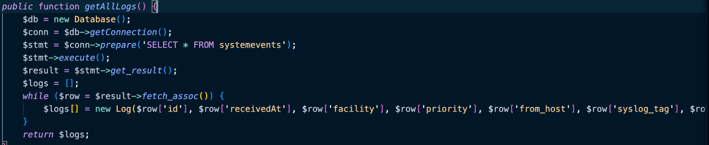
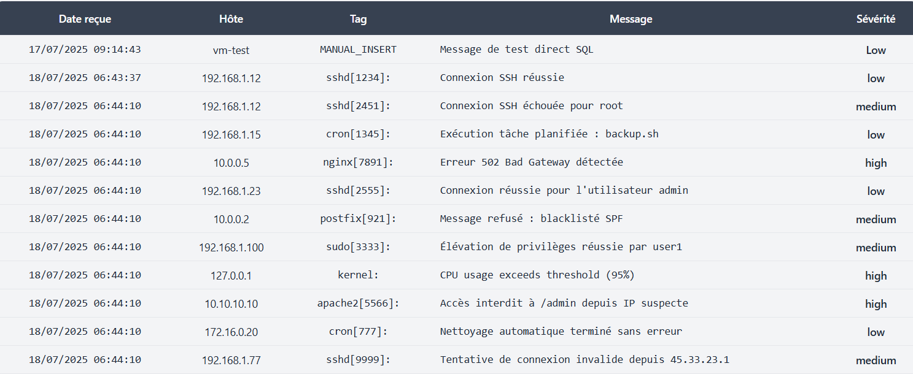
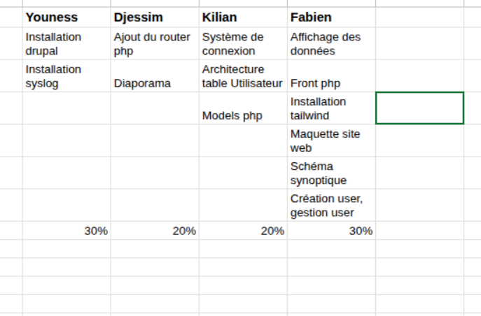
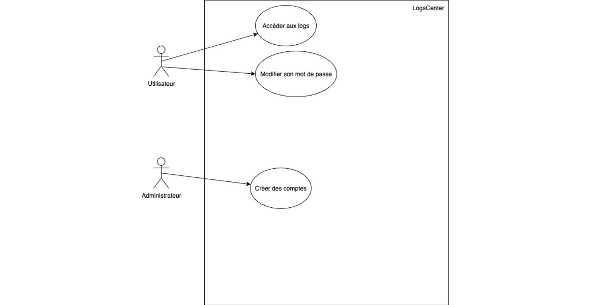
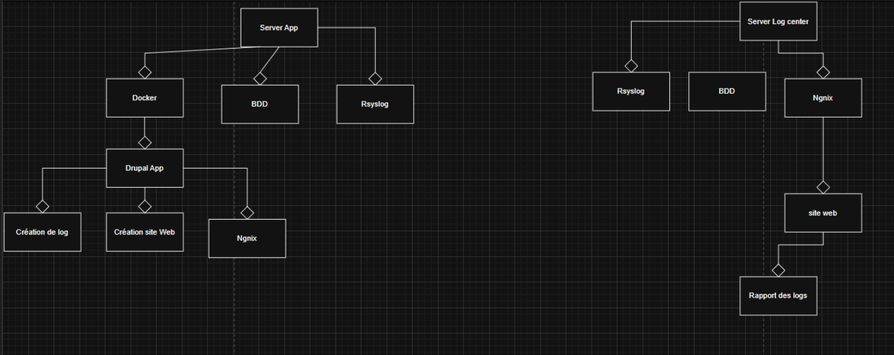

Titre: LogsCenter
Description: Log
Auteur: ~
URL: http://logscenter.fabienmcl.fr
Lien Repository : https://github.com/KilianBrd/LogsCenter
                  https://github.com/KilianBrd/LogsCenterWeb
---

---

# Sommaire :

- Contexte  
- Besoin  
- Objectif  
- Fonctions Principales 
- Critères de Performances  
- Technique de Contraintes 
- Tableau des tâches 
- Livrables  
- Matériel et Logiciel 
- Schéma Synoptique 
- Diagramme Cas d'utilisation  
- Diagramme de bloc   
- Plan de Site
- Maquette

---

# Contexte : 

              

---

# Besoin : 

- Site Web
- Génère des logs 
- Utiliser Rsyslog
- Préconisation de l'Agence National de la sécurité des Systèmes d'Information (ANSSI)

---

# Objectif : 

- Centraliser des Logs sur une Application Web

---

# Fonction Principales  : 

- Affichage des Logs
- Collecte des Logs 
- Charger un utilisateur par email

---

# Critères de Performances :
  
  - Rafraîchissement manuel de la page Web lors de l'ajout de nouveaux Logs

   

---

# technique de Contraintes : 

- Coder en PHP 
- Utiliser Rsyslog
- Utiliser deux Machines Virtuelles

---

# Tableau des tâches 

---

# Livrable :

- Deux Machines Virtuelles(Application et LogsCenter)
- La Documentation du Site Web 
- Les différents Diagrammes
- Repository Github
- Documentation d'Analyse de l'Anssi
- Tests de Validation

---

# Matériel et Logiciel :

- Deux Machines Virtuelles
- Rsyslog7
- Drupal 
- PHP 
- Github
- Mysql
- Visual Studio Code 
--- 
# Schéma Sypnotique

https://github.com/KilianBrd/LogsCenter/blob/main/Sch%C3%A9ma/Synoptique.png

--- 

#  Diagramme Cas d'Utilisation :

---

# Diagramme de Bloc :

---

# Plan de Site :

https://github.com/KilianBrd/LogsCenter/blob/main/Maquette/PlanSite.md

---

# Maquette :

https://github.com/KilianBrd/LogsCenter/blob/main/Maquette/Login-by-super-pdf.pdf
