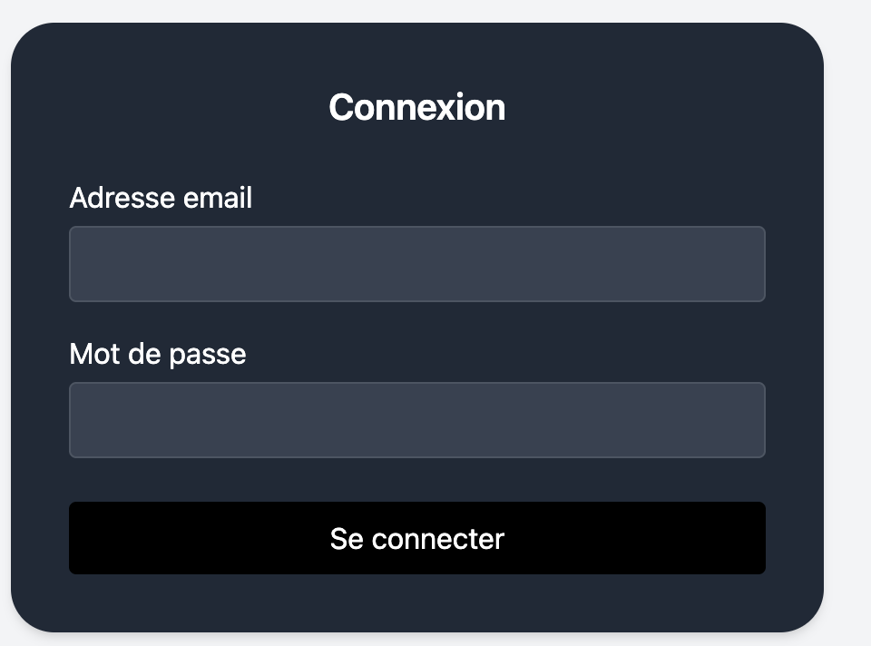
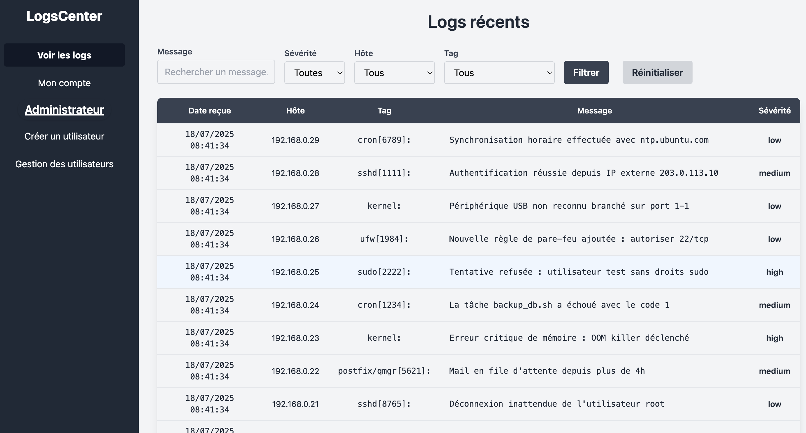
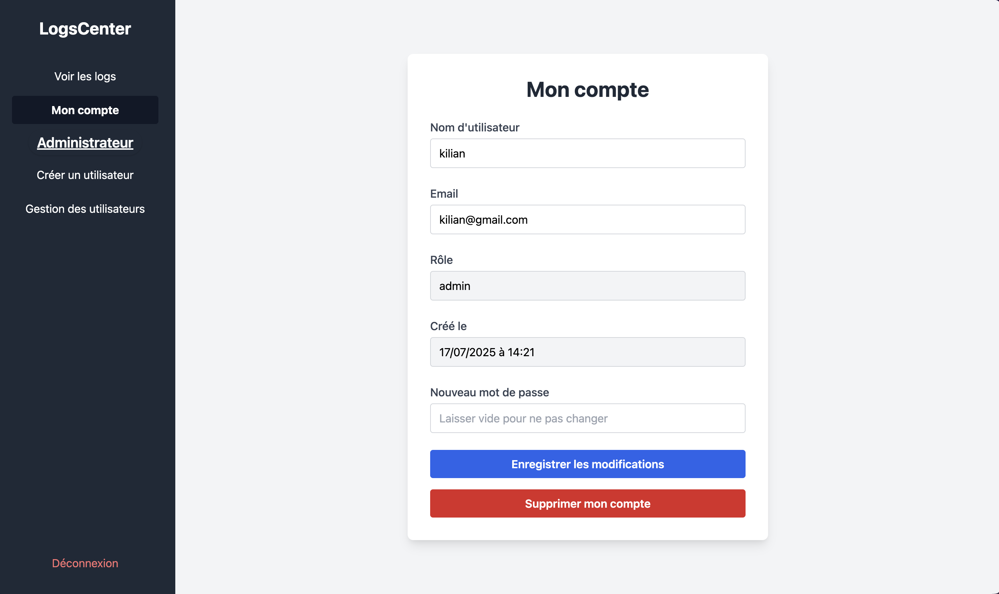

# Documentation utilisateur

- Accéder aux logs : 
    - Se connecter
    - Accéder au tableau de bord 

- Modifier son mot de passe : 
    - Se connecter
    - "mon profil" 
    - On peut modifier le mot de passe

- Créer des comptes 
    - En tant qu'administrateur : possibilté d'accéder à créer un utilisateur.
    